# Pharmacy Management System

A desktop pharmacy operations system built with Java Swing and MySQL.
It helps manage medicines, customer records, employees, billing, and day-to-day stock movement with a simple role-based workflow.

## Overview

This project was developed in NetBeans as a practical inventory and billing solution for pharmacy use cases. It replaces manual workflows with database-backed operations, improving speed and reducing entry errors.

## Features

- User login and role-based access
- Medicine inventory management (add, update, view)
- Customer management (add, update, view)
- Employee management (owner controls)
- Sales workflow and bill generation
- Dashboard screens for owner and worker usage

## Tech Stack

- Language: Java
- UI: Java Swing
- Database: MySQL
- Data access: JDBC
- IDE: NetBeans 24

## Project Structure

- `src/pharmacy_management_system/` - all Swing UI screens and workflow classes
- `src/dao/` - DB connection provider and utility classes
- `db/schema.sql` - database schema
- `db/sample_data.sql` - optional sample seed data

## Requirements

- JDK 8 or higher
- MySQL 8.x
- MySQL Connector/J added in NetBeans libraries

## Installation and Setup

1. Clone this repository.
2. Open the project in NetBeans.
3. Create database schema:

```bash
mysql -u root -p < db/schema.sql
```

4. Configure database credentials:
- Copy `src/dao/db.properties.example` to `src/dao/db.properties`
- Update values for your local MySQL setup

5. Optional environment variables:
- `DB_URL`
- `DB_USER`
- `DB_PASSWORD`

6. Run the main class:
- `pharmacy_management_system.Pharmacy_management_system`

## Optional Demo Data

Load sample data for quick testing:

```bash
mysql -u root -p < db/sample_data.sql
```

## Screenshots

### Authentication

Login screen with role-based access control:


### Owner Dashboard & Functions

#### Dashboard Overview
Owner access to full system management:

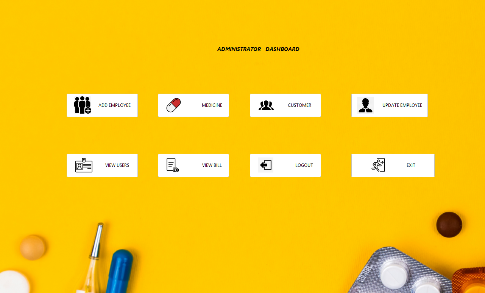

#### Medicine Management
Add new medicines and manage inventory:

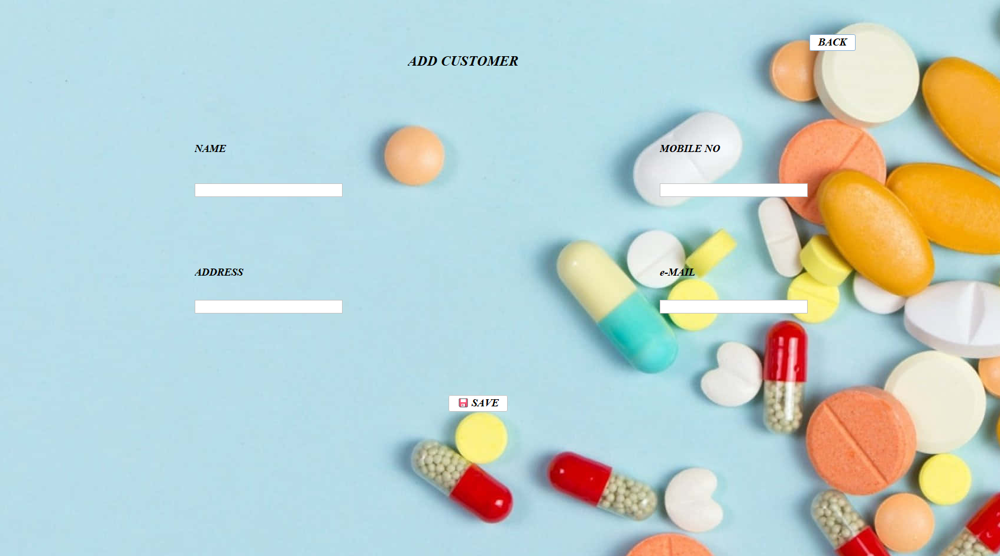

View all available medicines and stock levels:

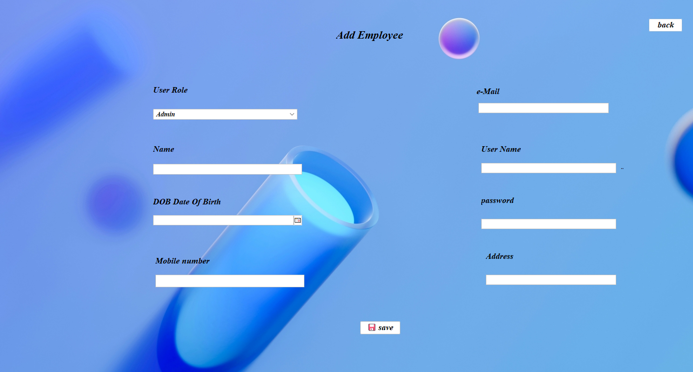

#### Customer Management
Register new customers:

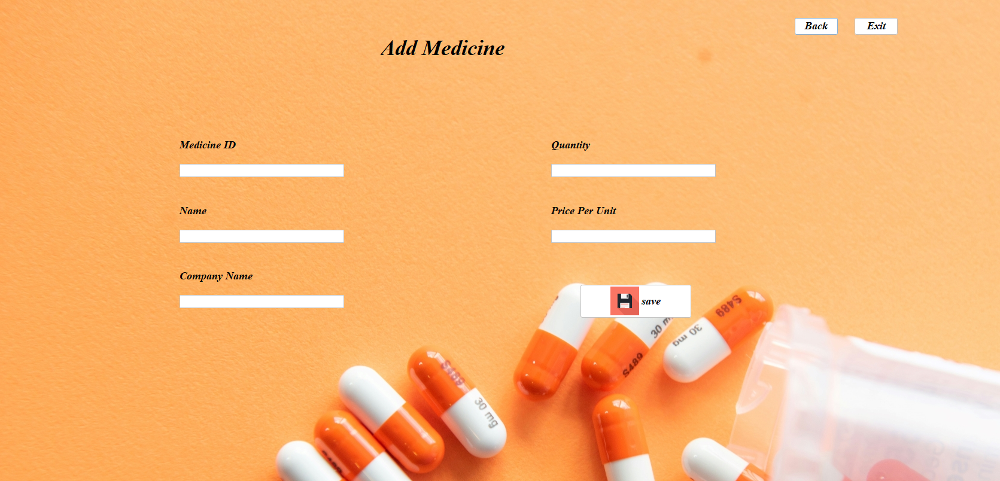

Track customer records and purchase history:

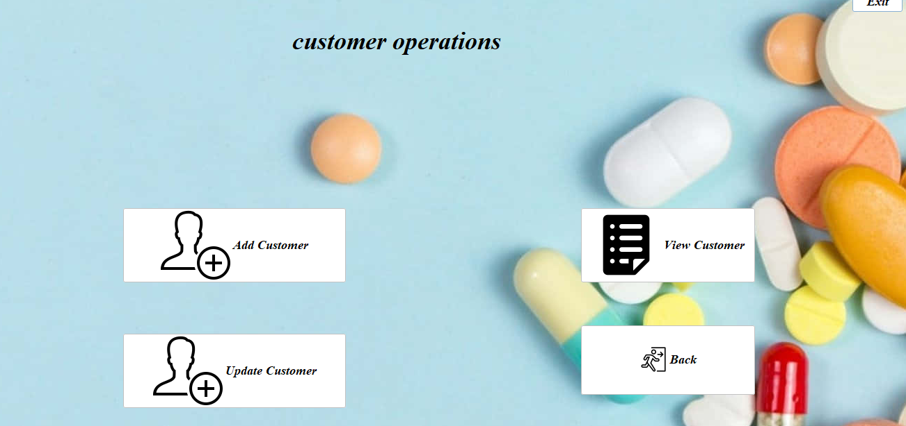

#### Employee Management
Add pharmacy staff and workers:

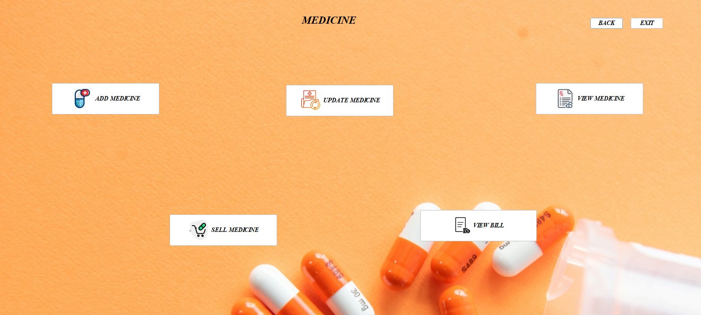

Monitor all employees in the system:


#### Owner Profile
View and manage account settings:

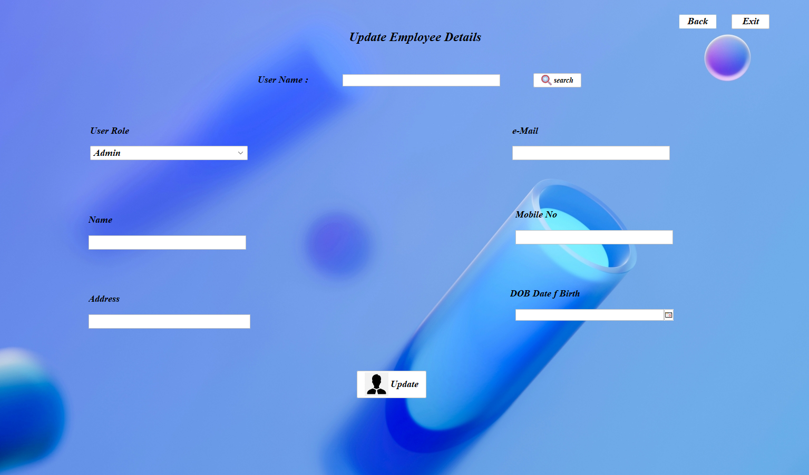

### Worker Dashboard & Functions

#### Dashboard Overview
Worker-level access for day-to-day operations:

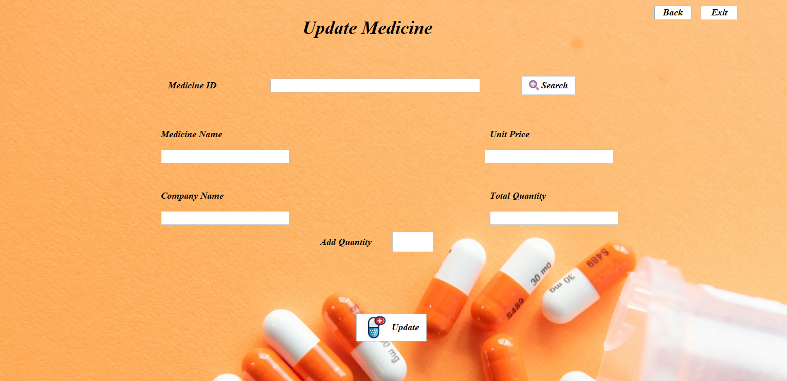

#### Sales Workflow
Register customers quickly during sales:


Sell medicines with cart interface and price calculations:

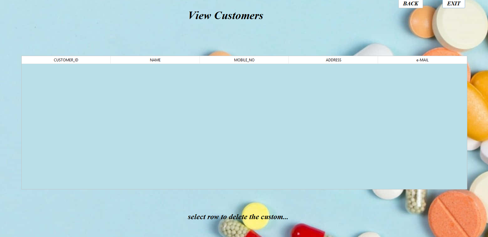

#### Bill Generation & Output
Complete sales transaction with inventory updates:

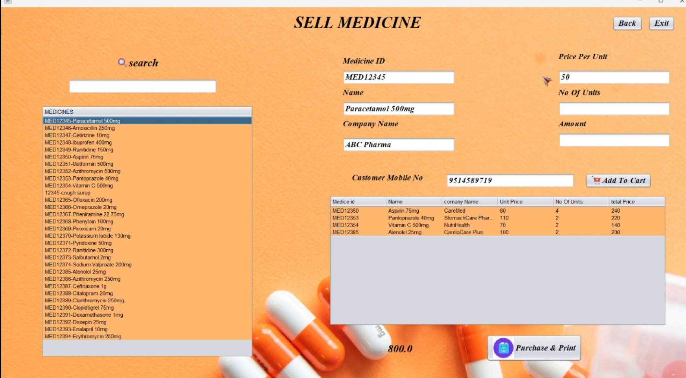

System generates professional PDF bills:

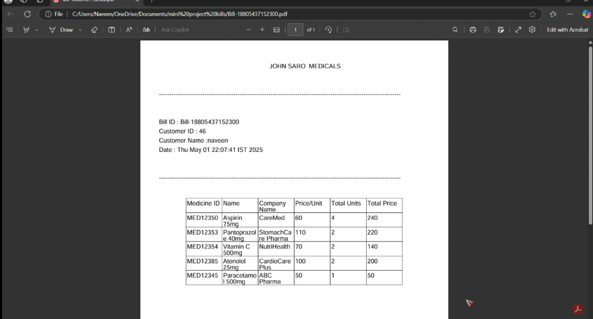

Bills can be viewed and shared digitally:

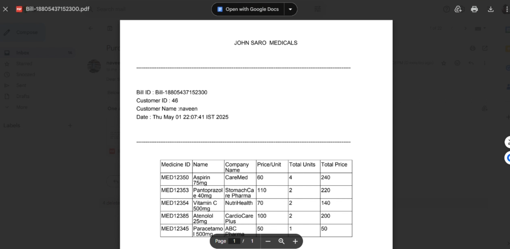

## Notes

- Default database name is `pharmacy` unless changed in config.
- Do not commit real production credentials.

## Future Improvements

- Low stock alerts
- Better validation and error messages
- Sales analytics report page
- Export history reports
